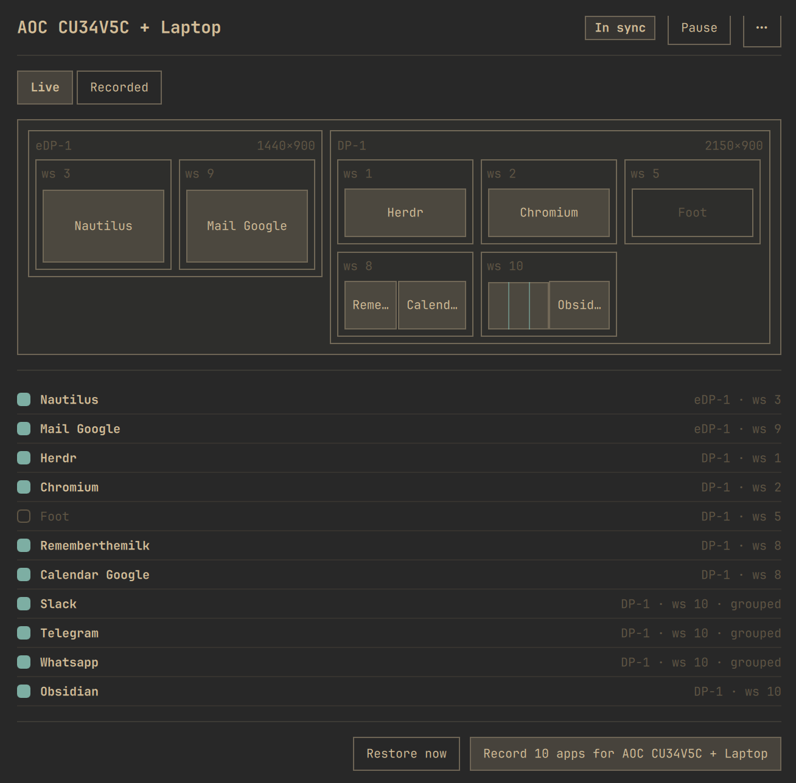

# Dock Recall

You use Omarchy differently with or without a monitor. Record how you like each
set up, and your windows auto-arrange when you dock and undock.

Undock, and Hyprland re-homes your windows onto the laptop panel. Dock again and
they stay there — piled onto one screen, on the wrong workspaces — and you spend
the first minute of the session dragging them back. Omarchy recovers *whether* a
display is on, and the monitor plugins remember *where the monitors go*. Neither
remembers *where the windows go*.



## Why you will want it

- **A layout per monitor setup.** Docked and undocked are recorded separately,
  keyed on your monitors' own EDID names, so the layout that comes back is the
  one you recorded for the setup you are actually in.
- **You choose what is watched.** Tick the apps you care about; everything else
  is left exactly where it is. A scratch terminal never gets moved because a
  restore ran.
- **It puts back more than the monitor.** Workspace, tab-group membership *in the
  recorded order*, floating geometry to the pixel, tiled shape and ratio.
- **It says so when it will not act.** Where the desktop cannot be read without
  guessing, the plugin refuses and the panel says why. Nothing is silently
  approximated into place.
- **Nothing is one-way.** Undo a recording right after you make it; a restore
  that could not place something lists the app and offers Retry; every recorded
  setup stays reachable from the panel.
- **Apps you closed come back too** — relaunched from a command derived from the
  process that was running, not from a guess, and landed in their recorded place
  rather than on whatever workspace has focus.
- **It stays out of the way.** No network access, no elevated privileges, no
  extra packages, no second Quickshell process. It reads `hyprctl`, writes one
  state file, and shows a toast only when it actually did something.

## Requirements

- Omarchy Quattro with third-party shell plugins (Hyprland 0.56)
- No AUR package, no runtime network dependency, no privileged helper

## Install

```bash
omarchy plugin add https://github.com/mkelk/dock-recall.git --enable
```

The bar widget defaults to the right-hand system cluster. To place it yourself:

```bash
omarchy bar move mkelk.dock-recall --section right --index 0
```

Confirm it loaded:

```bash
omarchy plugin list | grep mkelk.dock-recall
```

A service plugin needs a shell restart to become fully live the first time —
`omarchy restart shell` — after which `[dock-recall] service-ready` appears in
`qs log -p "$OMARCHY_PATH/shell"`.

### Update

```bash
omarchy plugin update mkelk.dock-recall --yes && omarchy restart shell
```

### Remove

```bash
omarchy plugin remove mkelk.dock-recall
```

Removing the plugin leaves your recordings in
`~/.local/state/omarchy/dock-recall.json`. Delete that file too if you want them
gone.

## The idea in three lines

1. Tick the running apps you care about.
2. Arrange them how you like, with the monitor setup you care about active, and
   hit **Record layout**.
3. On the next attach or detach, the layout recorded for *that* topology comes
   back.

Open the panel by clicking the bar glyph, or bind a key to it:

```bash
omarchy-shell shell summon mkelk.dock-recall '{"focus":"restore"}'
```

The `{"focus":"restore"}` payload opens the panel with **Restore now** focused,
so the whole round trip is one keystroke and Enter. A bare `'{}'` just opens it.

## The bar glyph

The small monitor shape in the bar is the fastest read on what the plugin
thinks is happening:

| Glyph | Means |
|---|---|
| hollow outline | no layout recorded for the current monitor setup |
| solid | recorded, and the desktop matches it |
| solid + accent dot | recorded, but windows have drifted from the recording |
| solid + urgent dot | the last restore reported a failure |
| solid + sweep band | a restore cycle is running right now |

## The panel

- **Workspace map** — mini-monitors with true-proportion window chips. Hovering a
  chip highlights its row and the other way round.
- **App list** — every window Hyprland is showing, ordered monitor → workspace →
  position, with a tick per app. Unticked apps are ignored by every restore.
  Apps with several windows get one row per window.
- **Record layout / Restore now** — record the current arrangement for the current
  topology, or replay the recording immediately without waiting for a cable.
- **Undo record** — immediately after recording, put the previous recording back.
  One shot, held in memory: a net under the moment you just had, not a history.
  Forgetting a topology is undoable the same way.
- **Failed list** — when a restore could not place something, the app is listed
  with a Retry button, reachable by pointer and by keyboard.
- **Overflow menu (`⋯`)** — every recorded topology, its glyph state, re-record
  and forget.
- **Pause / Activate** — stop reacting to monitor events without losing anything.
- Full keyboard navigation; Escape closes the panel.

Every restore runs three settle passes, at 1 s, 3 s and 7 s after the trigger, so
a monitor that takes two seconds to wake up is not a race. "Nothing happened" is
only true about ten seconds after a dock.

## Where it refuses

Refusals are the design, not gaps waiting to be filled. Each one is visible in
the panel with its reason:

- **Two identical monitors** — twin displays with the same EDID description cannot
  be told apart reliably, so the topology is refused rather than restored onto a
  coin flip.
- **A terminal running an ambiguous command** — see below.
- **Tiled shapes that differ by more than one split flip** — a single flipped split
  is repaired with one `togglesplit`; anything deeper is refused and tagged
  *shape differs* in the list, because a tiling tree is not addressable enough to
  reconstruct blindly.
- **Special workspaces** are filtered out at record time. Hyprland addresses them
  with relative selectors, and dispatching against them moves an innocent
  workspace while reporting success.
- **A locked session** — group joins and split flips are deferred and replayed at
  unlock instead of being dispatched into a lock screen.

## Terminal-hosted apps need their own window class

Matching and launch derivation are keyed on the window **class**. A TUI app
running inside a plain terminal (say `herdr` typed into `foot`) is invisible: the
window is just class `foot`, indistinguishable from every other terminal, and its
`/proc` cmdline is the terminal's, not the app's. Give such apps a dedicated
class **at launch**:

```bash
foot --app-id=herdr herdr
```

That means remapping whatever keystroke launches it, and shipping a `.desktop`
file with a matching `StartupWMClass`. With the app-id in place the panel sees a
distinct chip, learns the exact launch command from `/proc`, and restores the app
like any other.

### The panel can usually write that command for you

If you tick a terminal window whose own command line is nothing but the terminal,
the panel looks at the terminal's **child process** — the thing actually running
inside it — and offers the launch command to learn. A plain interactive shell in
between is looked through, so `foot` → `bash` → `herdr` derives just as well.

The command **shape** differs per terminal, not just the flag, and the panel
writes the one that actually runs:

```bash
foot --app-id=herdr herdr         # foot, footclient
kitty --class=herdr herdr         # kitty
alacritty --class=herdr -e herdr  # Alacritty, Ghostty
```

It only does this when the answer is **unambiguous — exactly one child**. A
terminal running two things, a shell with two jobs, or a terminal sitting at an
empty prompt is refused out loud: the row reads *runs in a terminal — give it its
own `--app-id`*, no command is offered, and nothing is guessed. Deriving one of
two candidates would write a launch command that silently reopens the wrong app,
and you would only find out at the next restore.

A launch command belongs to the **app**, not to one of its windows: if a recording
holds two windows of the same app and neither is running, the tool runs that one
command twice, waiting for each window to appear before starting the next. Apps
that need different arguments per window need a class per window — the app-id rule
again.

## What it touches

Everything Dock Recall does is local, unprivileged and inspectable:

| Path | What it holds |
|---|---|
| `~/.local/state/omarchy/dock-recall.json` | your recordings, one per topology |
| `~/.local/state/omarchy/dock-recall.status.json` | what the bar glyph reads |
| `~/.local/state/omarchy/dock-recall.trigger` | a one-shot restore request |
| `~/.local/state/omarchy/dock-recall-forensics/` | snapshots of restores that failed |

It runs `hyprctl` to read the desktop and dispatch moves, reads `/proc` and
`.desktop` files to derive launch commands, and calls `notify-send` for the
restore toast. It makes no network requests, asks for no privileges, installs
nothing, and never writes to your Hyprland or Omarchy configuration.

## How well does it actually work?

The measurement surface is [`scripts/verify`](scripts/verify): it prints a
recorded-vs-live table for the current topology and exits 0 only when every
watched window is where the recording says it should be, with floating windows
inside a ±2 px tolerance and tiled windows scored by intersection-over-union.

Underneath that, every state the desktop can be in has a defined behaviour and a
test that pins it — including the ones the plugin deliberately refuses, which are
written down as refusals rather than left as gaps. `tests/` is where that
contract lives: 686 tests over real `hyprctl` fixtures, plus `tests/sim-dock.sh`,
which drives the installed plugin end to end against a headless output.

The behaviour has also been through a physical checklist on a real ultrawide over
a dock — cold dock, dock with the desktop deliberately scattered, undock,
undock while the session is locked, and suspend-dock-wake.

## Development

The brain is dependency-free ES5 JavaScript in [`engine.js`](engine.js),
[`StateModel.js`](StateModel.js) and [`PanelModel.js`](PanelModel.js) — no
QML, no clock, no I/O — so it is testable under node against real `hyprctl`
fixtures (see [`tests/fixtures/README.md`](tests/fixtures/README.md)):

```bash
node --test 'tests/**/*.test.js'   # 686 tests, no dependencies
omarchy plugin validate .          # manifest + entry points
qmllint -I "$OMARCHY_PATH/shell" Service.qml Panel.qml BarWidget.qml
./scripts/dev-install --restart    # install this working tree and restart the shell
./tests/sim-dock.sh                # end-to-end: fake topology, record, restore, verify
```

`sim-dock.sh` drives the installed plugin with a headless output and its own
scratch windows, backs your real state file up and restores it byte-for-byte
afterwards. `scripts/bench` measures restore quality — shape and ratio
intersection-over-union across recorded rounds — for when a change to the
placement planner needs a number rather than an opinion.

The repository root **is** the plugin folder, because `omarchy plugin add` clones
the repository and installs the clone root. Tests and scripts ride along; the shell
loads only the three entry points the manifest declares.

## License

MIT — see [LICENSE](LICENSE).
